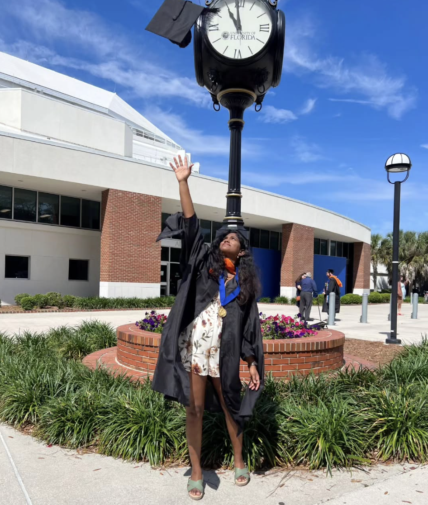
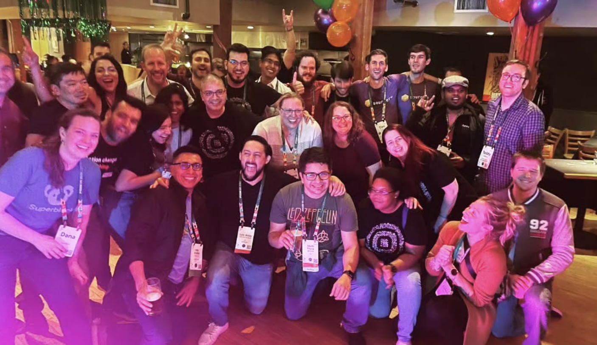
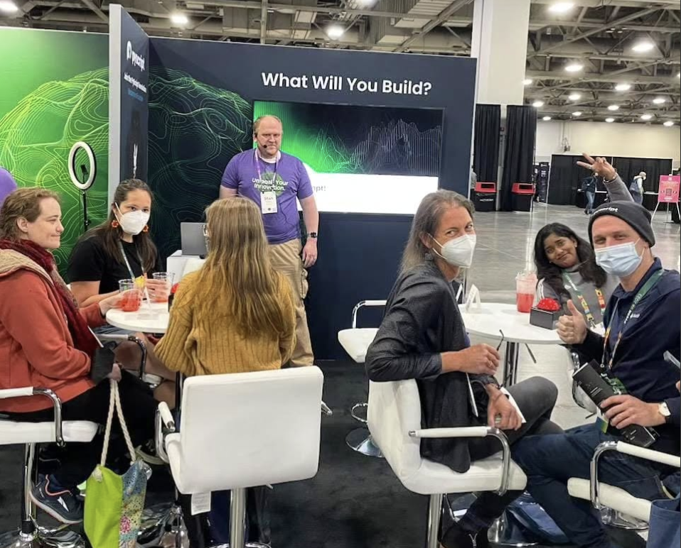
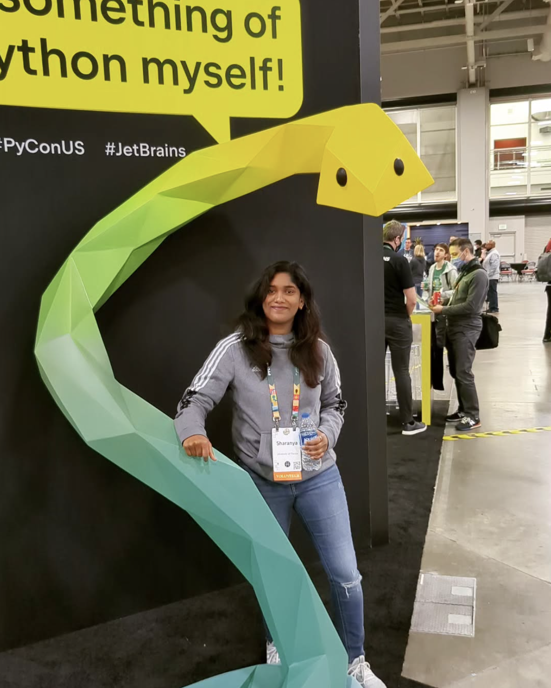

# 👋 Hi, I'm Srisharanya Injarapu!  

🚀 **Full-Stack AI Engineer | AI Systems Engineer | Data & ML Pipeline Engineer**  

I specialize in building state-of-the-art **AI and ML solutions** that drive impactful results. With over 5 years of hands-on experience, I excel at developing **end-to-end machine learning pipelines**, **large language model optimization**, and **advanced computer vision systems**. My expertise spans **generative AI**, **multi-modal models**, and **ML infrastructure deployment** using **Docker**, **Kubernetes**, and **Cloud Platforms**.  

🎓 **Education**: University of Florida Graduate

---

### 🤝 Community Engagement:
- 🎤 **Conference Speaker & Attendee**: Active participant at PyCon US and other tech conferences
- 👥 **Tech Community Builder**: Engaging with developer communities and sharing knowledge
- 🌟 **Mentorship**: Contributing to the growth of aspiring developers
  

  

---

### 🔥 Key Expertise:  
- **Computer Vision**: Advanced object detection, segmentation, quantification, and spatial analysis using **YOLO**, **PyTorch**, and **JetsonOrin**.  
- **Large Language Models (LLMs)**: Efficient model compression (52% reduction) and deployment for real-world NLP applications using **Huggingface** and **Langchain**.  
- **Generative AI**: Designing RAG-based store-specific chatbots and developing NLP-powered tools for enhanced user experiences.  
- **End-to-End ML Pipelines**: Building scalable ML solutions with **FastAPI**, **Docker**, **Kubernetes**, and **CI/CD** for seamless integration and deployment.  
- **MLOps and Model Monitoring**: Using **MLflow**, **DVC**, **Prometheus**, and **Grafana** for robust model tracking and real-time monitoring.  

---

### 🔧 Tech Stack:  
- **Programming Languages**: Python, SQL, Bash  
- **Machine Learning & AI**: PyTorch, Huggingface, Langchain, OpenAI API, TensorFlow  
- **Computer Vision**: YOLO, OpenCV, JetsonOrin, RaspberryPi  
- **MLOps & Deployment**: Docker, Kubernetes, MLflow, FastAPI, Prometheus, Grafana  
- **Cloud & DevOps**: Azure, AWS, GitHub Actions, Terraform  
- **Data Engineering**: SQL, MongoDB, DVC  

---

### 🚀 Notable Projects:  
- **[Inventory Vision System](#)**: Achieved over 97% accuracy in inventory tracking using advanced computer vision and dual-camera depth detection technology.  
- **[LLM Compression](#)**: Compressed transformer-based LLMs by 52%, reducing memory usage by 67% and execution time by 75%.  
- **[Store-Specific Chatbot](#)**: Designed an RAG-based chatbot for retail management, leveraging **Langchain** and **Pinecone** for real-time query resolution.  
- **[Intelligent Data Pipelines](#)**: Developed scalable ETL pipelines for processing massive text data, optimizing embeddings for NLP models.  

---

### 📈 My Impact:  
- Optimized cloud-native ML pipelines, reducing deployment time by 30% and increasing model accuracy by 15%.  
- Improved inventory control capabilities using spatial analysis and computer vision, leading to significant operational efficiencies.  
- Identified high-growth chemical products with predictive models, driving $35 billion in sales and a 400% ROI.  

---

### 🌐 Let's Connect:  
- **LinkedIn**: [Srisharanya Injarapu](https://www.linkedin.com/in/srisharanya-injarapu/)  
- **Email**: [injarapusrisharanya@gmail.com]  

Feel free to explore my repositories and reach out for collaborations in **Machine Learning**, **Computer Vision**, or **Generative AI**!  
